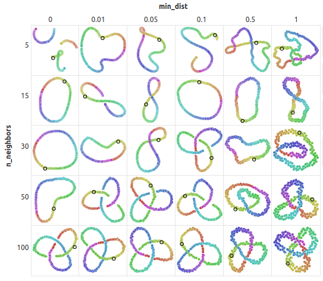
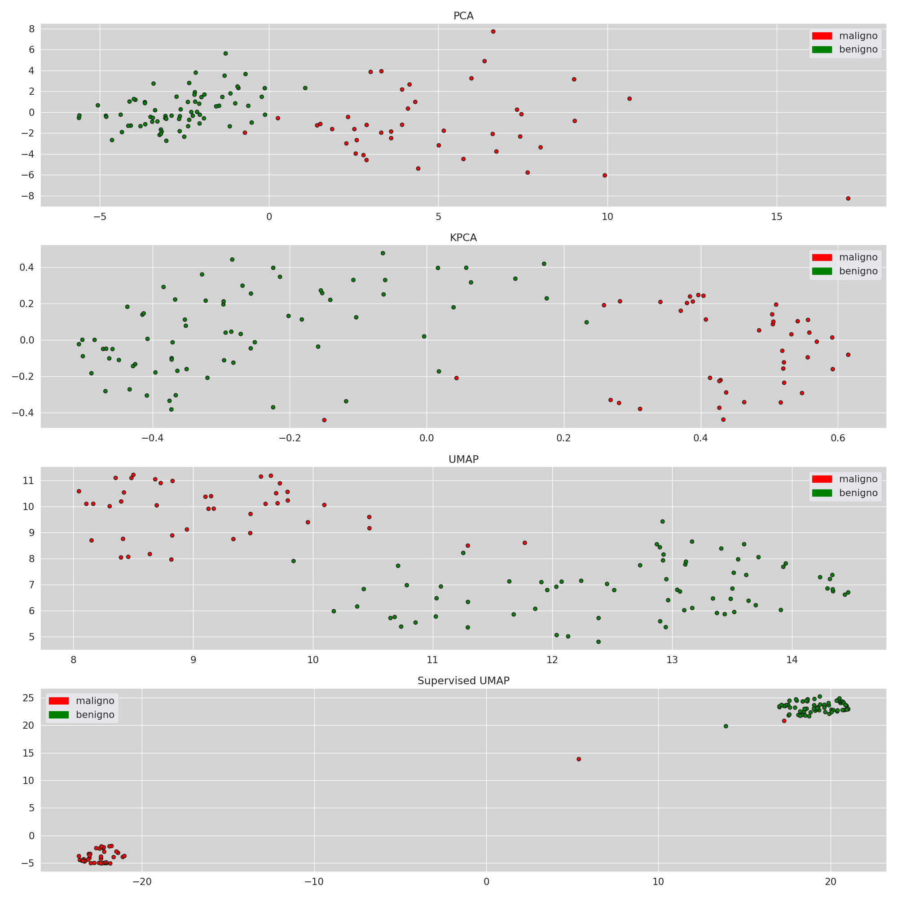

# Introducción

---

## Introducción

El dataset de Cáncer de mama de Wisconsin es comúnmente usado dentro del campo de machine learning para tareas de clasificación. Contiene información sobre biopsias de tumores que sirve para poder predecir si un tumor es benigno o maligno.
<!-- Explicar la problemática -->

---

## Objetivo

Generar un modelo de clasificación para predecir si un tumor es benigno o maligno, y utilizar **algoritmos de reducción de dimensionalidad** para tratar de mejorar la eficacia del modelo.

# Algoritmos

---

## Algoritmos de reducción de dimensionalidad

La reducción de dimensionalidad es un conjunto técnicas de aprendizaje que sirven para **reducir** la cantidad de features, o variables, de un dataset a la vez que se **retiene** la mayor cantidad de información relevante como sea posible. En otras palabras, se encargan de transformar un dataset para llevarlo a un espacio de variables de menor dimensionalidad sin perder información.

---

## Algoritmos de reducción de dimensionalidad

Ya que estos algoritmos únicamente transforman al dataset, se los suele utilizar como complemento para algún otro algoritmo principal, ya sea de clasificación, regresión, etc. con el objetivo de mejorar el rendimiento y la eficiencia del mismo.

---

### La maldición de la dimensionalidad

Este término refiere a un problema común en machine learning relacionado al hecho de que el rendimiento de un modelo empeora a medida que crece la cantidad de features de los datos a analizar. 

Adicionalmente, en algunos casos puede ocurrir también que al tener una gran cantidad de variables, donde no todas son verdaderamente relevantes, termina siendo mucho más difícil para el modelo lograr generalizar la información aprendida, incurriendo en overfitting del dataset.

---

### La maldición de la dimensionalidad

Los algoritmos de reducción de dimensionalidad resuelven este problema reduciendo o transformando los conjuntos de datos para quedarse únicamente con la información más relevante.

---

## Tipos

- <u>**Feature Selection:**</u> técnicas que buscan **seleccionar** del dataset original únicamente las variables más relevantes para el problema a tratar. Para esto se utilizan diferentes tipos de modelos, como pueden ser los de filtrado, los envolventes, los integrados, etc. Algunos ejemplos de éstos algoritmos son: _test Chi-Squared, el coeficiente de correlación ANOVA y el coericiente de correlación de Pearson_ 
<!-- 
- Los métodos de filtro clasifican las características en función de su relevancia para la variable objetivo, 
- los métodos envolventes utilizan el rendimiento del modelo como criterio para seleccionar las características, 
- los métodos integrados combinan la selección de características con el proceso de entrenamiento del modelo.
-->
- <u>**Feature Extraction:**</u> estas técnicas en cambio buscan crear nuevas features **combinando y transofrmando** las existentes. Este nuevo conjunto de variables conserva la escencia de la data original pero en un espacio de menor dimensión. Ejemplos de estos métodos son: _PCA, UMAP y t-SNE_

---

## Tipos

- <u>**Lineales:**</u> Asumen que los datos se encuentran distribuidos en un **subespacio lineal** del espacio de alta dimensionalidad original. Por lo tanto, intentan hallar una transformación lineal que convierta al conjunto de datos a dicho espacio de menor dimensión, a la vez que preserva la relación entre los mismos. 

- <u>**No lineales:**</u> Trabajan con la hipótesis de que los datos están distribuidos en una **variedad** (manifold) n-dimensional y que poseen una distribución que puede representarse en un espacio de menor dimensión, por lo que buscan hallar la representación que mantenga en mayor medida la estructura de los datos. 

  Dentro de esta categoría se pueden hallar dos sub-clases: los algoritmos que se enfocan en preservar la estructura _local_, y los que buscan mantener la estructura _global_.

---

## PCA

El Análisis de Componentes Principales es una técnica de Feature Extraction lineal que busca transformar al dataset para obtener un conjunto de variables que son combinaciones lineales de las originales pero sin correlación lineal.

El objetivo de PCA es eliminar la **redundancia** en los datos.

---

## PCA - Funcionamiento

Busco encontrar $q < p$ variables que sean combinaciones lineales de las originales, recogiendo la mayor parte de la información o **variabilidad** de los datos.

Entonces vamos a buscar $p$ componentes principales y luego elegimos las $q$ más relevantes.

---

## PCA - Funcionamiento

Para encontrar los componentes principales de un conjunto de datos primero se debe calcular la _matriz de covarianza_ de las variables centradas en cero (esto es, restándole la media de sus valores observados). Luego, se calculan los **autovectores** (normalizados) y **autovalores** de dicha matriz.

Cada uno de los autovectores representa una dimensión del nuevo espacio de datos, mientras que los autovalores correspondientes representan el nivel de varianza de dicha dimensión sobre el dataset. 

---

## PCA - Funcionamiento

De esta forma, para obtener el nuevo dataset se ordenan los autovectores por su autovalor correspondiente de forma descendente, tomando luego primeros $n$ para el cálculo de las componentes principales. En este caso $n$ sería la cantidad de variables deseada para el dataset resultante.

---

## PCA - Funcionamiento

Matemáticamente, sea un dataset con $m$ variables: 

$$
X = \{x^1,\dots,x^P\}
$$
$$
x^p=(x_1^p, x_2^p,\dots, x_m^p)
$$

Y sea $S_x$ su matriz de covarianza, tal que:
$$
\text{det}(S_x - \Lambda_i \mathbb{I}) = 0
$$
$$
S_x \overline v_i = \Lambda_i \overline v_i
$$

---

## PCA - Funcionamiento

Los componentes principales $y_1,\dots,y_n$ se calculan como la combinación lineal de los autovectores $\overline v_i=(v_{1i},\dots,v_{mi})$ con las observaciones de $X$:
$$
y_1 = v_{11} \ x_1 + v_{21} \ x_2 + \dots + v_{m1} \ x_m
$$
$$ \vdots $$
$$
y_n = v_{1n} \ x_1 + v_{2n} \ x_2 + \dots + v_{mn} \ x_m
$$

---

## PCA - Ejemplo Dataset Iris

---

## Variación: KPCA

Es una extensión de PCA que utiliza un **Kernel** para transformar datos con distribuciones _no lineales_ a un espacio lineal y así poder trabajar con ellos. Es análogo al algoritmo KSVM que permite extender la funcionalidad de SVM a espacios no lineales.

En principio este método es muy útil ya que extiende la funcionalidad de PCA, pero depende exclusivamente de una buena elección del Kernel, además de poder volverse computacionalmente intenso por el cálculo de la transformación al espacio de mayor dimensionalidad.

---

## UMAP

_UMAP (Uniform Manifold Approximation and Projection) es una novedosa técnica de aprendizaje de variedades para la reducción de dimensiones._

Se trata de una técnica de reducción de dimensionalidad estocástica y no lineal que genera una representación topológica de los datos y en base a ella trata de hallar una representación similar en un espacio de menor dimensión que preserve tanto la estructura local como la global.

---

## UMAP

### Conceptos Base

---

### Variedad (Manifold)

Una variedad de dimensión $n$ es un espacio topológico en el cuál todo punto del mismo es localmente similar a $\mathbb{R}^n$. 

Un ejemplo de variedad es el globo terrestre, el cuál se trata de una variedad de 2 dimensiones ya que todo punto puede aproximase con un plano bi-dimensional (como sería el caso de los mapas).

<!-- TODO: Esto es útil porque quiere decir que si bien la data se encuentra en n dimensiones, está distribuída en un espacio que puede representarse con una menor cantidad de dimensiones -->

---

### Complejo simplicial difuso

Un complejo simplicial difuso (_Fuzzy Simplicial Complex_) es un tipo especial de complejo simplicial, esto es, un conjunto de **simplex** (puntos, segmentos de línea, triángulos, y sus equivalentes en n-dimensiones) que estan unidos mediante sus caras. 

Estos complejos sirven para generar la representación topológica del conjunto de datos a analizar.

---

## UMAP

### ¿Cómo funciona?

---

## UMAP - Funcionamiento

El algoritmo de UMAP utiliza una herramienta llamada Čech complex para generar un complejo simplicial en base al conjunto de datos. Para esto, se toman bolas centradas en cada uno de los puntos y se arman conexiones en aquellos lugares donde se encuentren intersecciones.

:::{.container .r-stretch}

::::{.flex-1}

::::
::::{.flex-1}

::::
:::

---

## UMAP - Funcionamiento

Sin embargo, para simplificar la representación de los datos y el procesamiento requerido, UMAP arma únicamente representaciones con 0- y 1-simplex (puntos y líneas). Esto hace que la estructura topológica resultante termine siendo, en escencia, un **grafo**.

Esta representación sigue teniendo problemas ya que, por ejemplo, dependiendo del radio que se elija para conectar los puntos es posible que haya instancias que queden completamente conectadas o que cuenten con demaisadas conexiones entre sus vecinos.

---

## UMAP - Funcionamiento

Para que este sistema funcione, el algoritmo asume que los puntos del dataset son parte de una **variedad n-dimensional** y que además se encuentran distribuídos de manera uniforme sobre la misma.

De esta manera, si se observan distancias distintas entre distintos puntos, eso significa que la **noción de distancia es variable** a lo largo de la variedad, que es el espacio el que se deforma y hace aparentar una distribución no uniforme.

---

## UMAP - Funcionamiento

Entonces, para cada punto se considera una distancia variable y la misma se toma en función de la distancia con los vecinos más cercanos.

---

## UMAP - Funcionamiento

El vínculo que se arma entre los puntos de datos es más débil mientras más lejos se encuentren los mismos (de acuerdo a la función de distancia local de cada punto). En esta parte es donde entra en juego la característica difusa (fuzzy) del complejo simplicial que se genera. 

Ahora la estructura resultante es un grafo con pesos que son proporcionales a la distancia entre los vértices.

{.img-s}

---

## UMAP - Funcionamiento

Adicionalmente, para garantizar que todos los puntos estén conectados con al menos otro punto del dataset la conexión entre los puntos se vuelve difusa sólo a partir del primer vecino más cercano. 

Esto es particularmente útil ya que en espacios de alta dimensionalidad las distancias entre puntos tienden a ser largas y uniformes. De esta forma, la distancia se mide más en términos de vecinos cercanos que en valores absolutos. 

{.img-s}

---

## UMAP - Funcionamiento

De esta forma se arma un grafo con los puntos de dataset como vértices conectados por aristas cuyo valor representa la probabilidad de que la conexión entre dichos elementos realmente exista.

---

## UMAP - Funcionamiento

Para hallar la representación topológica en una menor dimensión se busca la estructura que posea los mismos vértices y cuyas aristas sean lo más cercanas posibles al grafo original. Ya que las aristas se interpretan como la probabilidad de conexión entre puntos, se toma como medida de cercanía entre ellas la cross-entropy.

Sea $E$ el conjunto de todas las aristas posibles, con funciones de peso $w_h(e)$ para la estrucutra de mayor dimensión y $w_l(e)$ para la de menor, la cross-entropy se define como:

$$
\sum_{e\in E}w_h(e)\log ({w_h(e)\over w_l(e)}) + (1-w_h(e))\log ({1-w_h(e)\over 1 - w_l(e)})
$$

---

## UMAP - Funcionamiento

Este cálculo de la entropía resultará en representaciones en bajas dimensiones donde los datos con una conexión mas fuerte en su representación original se encontrarán más cercanos entre sí, mientras que los datos con conexiones más débiles se ubicarán a mayores distancias.

---

## UMAP 

### Parámetros

---

<!-- ## UMAP - Parámetros -->

### n_neighbors

Limita la cantidad el tamaño del vecindario local que el algoritmo analizará al momento de armar la variedad. Tiene el efecto de determinar si el algoritmo se enfocará mayormente en representar la estructura local o la estructura global del dataset.

Valores más grandes de este parámetro harán que el algoritmo analice las relaciones con una mayor cantidad de puntos, teniendo una mirada más amplia de los datos. Por el contrario, valores más pequeños forzarán a UMAP a concentrarse sólo en el entorno local de cada dato.

---

<!-- ## UMAP - Parámetros -->

### min_dist

Define la distancia mínima que dos puntos pueden tener en la nueva representación de los datos. Representa en qué nivel puede UMAP compactar los puntos entre sí.

En líneas generales, valores más chicos de min_dist pueden ser útiles para clustering o análisis detallados de las estructuras de los datos, mientras que valores más grandes suelen preservar la estructura global del dataset.

---

### Ejemplo de variación de parámetros

---

<!-- ## UMAP - Parámetros -->

### n_components

Define la cantidad de dimensiones del nuevo espacio generado por el algoritmo. Debido a que UMAP suele utilizarse para visualización, los valores más comunes suelen ser 2 y 3, sin embargo es capaz de soportar valores mayores de ser necesario.

---

### metric

Define la función que se utilizará para el cálculo de la distancia entre puntos. Algunos ejemplos son:

- euclidean

- manhattan

- cosine

- hamming

---

## UMAP

### Ejemplos

---

### Dataset MNIST - Fashion

---

### Dataset MNIST - Digits

---

### Representación 3D del esqueleto de un mamut

:::{.container .r-stretch}

::::{.flex-1}

::::
::::{.flex-1}

::::
:::

---

## Variación - Supervised UMAP

Esta técnica es una extensión de UMAP que toma en cuenta la clase de cada punto al momento de calcular las distancias y de armar la representación de menor dimensionalidad. De esta forma, puntos de la misma clase tenderán a estar más cerca unos de otros, mientras que puntos de clases distintas tenderán a alejarse. Supervised UMAP sirve para mejorar la separación de clases entre sí, a cambio de un mayor coste computacional.

---

## Supervised UMAP - Ejemplo

:::{.container .r-stretch}

::::{.flex-1}

::::
::::{.flex-1}

::::
:::

# Dataset

---

## Dataset

Para este trabajo vamos a utilizar el dataset de Cáncer de Mama de Wisconsin, el cuál es popular dentro del campo de Machine Learning y puede obtenerse mediante la libería sci-kit learn. Este dataset contiene las características observadas sobre diferentes tumores a partir de imágenes digitalizadas de aspirados por aguja fina (FNA). El objetivo del mismo es poder tener una mejor comprensión de las características de los núcleos celulares para ayudar en el diagnóstico de cáncer de mama.

---

## Dataset - Variables

El dataset contiene 10 variables calculadas para los núcleos celulares dentro de cada imágen: 

1. **Radio** (media de distancias desde el centro hasta diferentes puntos exteriores)
2. **Textura** (desvío estándar de los valores de la escala de grises)
3. **Perímetro**
4. **Área**
5. **Suavidad** (variación local en el valor de los radios)
6. **Compacidad** ($\text{perimetro}^2 / \text{area} - 1$)
7. **Concavidad** (severidad de las porciones cóncavas del contorno)
8. **Puntos cóncavos** (cantidad de porciones cóncavas del contorno)
9. **Simetría**
10. **Dimensión fractal** ("aproximación de línea costera" - 1)

---

## Dataset - Variables

Cada una de estas variables se representa con tres valores: la _media_, el _desvío estándar_ y el _peor caso_. 

La variable objetivo es el diagnóstico, pudiendo ser benigno (B) o maligno (M)

En total hay 569 documentos, siendo 357 benignos y 212 malignos.

---

## Análisis exploratorio

---

### Cantidad de documentos por clase

---

### Matriz de correlación

{.stretch}

---

### Correlación de variables con respecto al diagnóstico

---

### Distribución de variables

# Optimización

Reducción de dimensionalidad

---

**Proyección de los datos de _entrenamiento_ con diferentes métodos**

---

**Proyección de los datos de _prueba_ con diferentes métodos**

# Resultados

---

## Accuracy por método

| Dataset                          | Training Accuracy | Test Accuracy |
|----------------------------------|-------------------|---------------|
| Original                         | 0.96              | 0.92          |
| PCA                              | 0.95              | 0.93          |
| KPCA                             | 0.93              | 0.89          |
| LLE                              | 0.93              | 0.94          |
| UMAP                             | 0.97              | 0.95          |
| Supervised UMAP                  | 1.00              | 0.97          |

---

## Dataset Original

---

### Dataset Original - Métricas

| Class | Precision | Recall | F1-Score | Support |
|-------|-----------|--------|----------|---------|
| 0.0   | 0.88      | 0.90   | 0.89     | 39      |
| 1.0   | 0.95      | 0.93   | 0.94     | 75      |
| **Accuracy**       |           |        | 0.92     | 114     |
| **Macro Avg**      | 0.91      | 0.92   | 0.91     | 114     |
| **Weighted Avg**   | 0.92      | 0.92   | 0.92     | 114     |

---

### Dataset Original - Matriz de confusión

{.stretch}

---

## PCA

---

### PCA - Métricas

| Class | Precision | Recall | F1-Score | Support |
|-------|-----------|--------|----------|---------|
| 0.0   | 0.88      | 0.92   | 0.90     | 39      |
| 1.0   | 0.96      | 0.93   | 0.95     | 75      |
| **Accuracy**       |           |        | 0.93     | 114     |
| **Macro Avg**      | 0.92      | 0.93   | 0.92     | 114     |
| **Weighted Avg**   | 0.93      | 0.93   | 0.93     | 114     |

---

### PCA - Matriz de confusión

<!--

---

## KPCA

| Class | Precision | Recall | F1-Score | Support |
|-------|-----------|--------|----------|---------|
| 0.0   | 0.80      | 0.92   | 0.86     | 39      |
| 1.0   | 0.96      | 0.88   | 0.92     | 75      |
| **Accuracy**       |           |        | 0.89     | 114     |
| **Macro Avg**      | 0.88      | 0.90   | 0.89     | 114     |
| **Weighted Avg**   | 0.90      | 0.89   | 0.90     | 114     | 

---

### LLE

| Class | Precision | Recall | F1-Score | Support |
|-------|-----------|--------|----------|---------|
| 0.0   | 0.97      | 0.85   | 0.90     | 39      |
| 1.0   | 0.93      | 0.99   | 0.95     | 75      |
| **Accuracy**       |           |        | 0.94     | 114     |
| **Macro Avg**      | 0.95      | 0.92   | 0.93     | 114     |
| **Weighted Avg**   | 0.94      | 0.94   | 0.94     | 114     |

-->

--- 

## UMAP

---

### UMAP - Métricas 

| Class | Precision | Recall | F1-Score | Support |
|-------|-----------|--------|----------|---------|
| 0.0   | 0.90      | 0.95   | 0.93     | 39      |
| 1.0   | 0.97      | 0.95   | 0.96     | 75      |
| **Accuracy**       |           |        | 0.95     | 114     |
| **Macro Avg**      | 0.94      | 0.95   | 0.94     | 114     |
| **Weighted Avg**   | 0.95      | 0.95   | 0.95     | 114     |

---

### UMAP - Matriz de Confusión

---

## Supervised UMAP

---

### Supervised UMAP - Métricas

| Class | Precision | Recall | F1-Score | Support |
|-------|-----------|--------|----------|---------|
| 0.0   | 0.97      | 0.95   | 0.96     | 39      |
| 1.0   | 0.97      | 0.99   | 0.98     | 75      |
| **Accuracy**       |           |        | 0.97     | 114     |
| **Macro Avg**      | 0.97      | 0.97   | 0.97     | 114     |
| **Weighted Avg**   | 0.97      | 0.97   | 0.97     | 114     |

---

### Supervised UMAP - Matriz de Confusión

# GRACIAS
