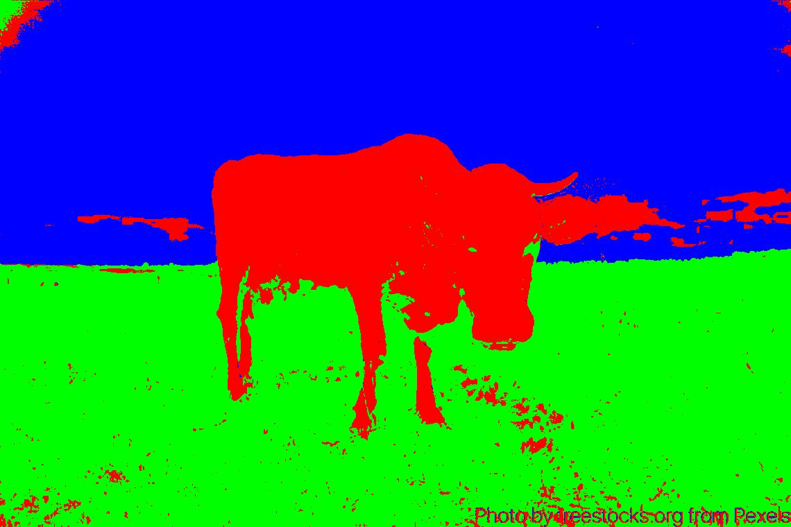
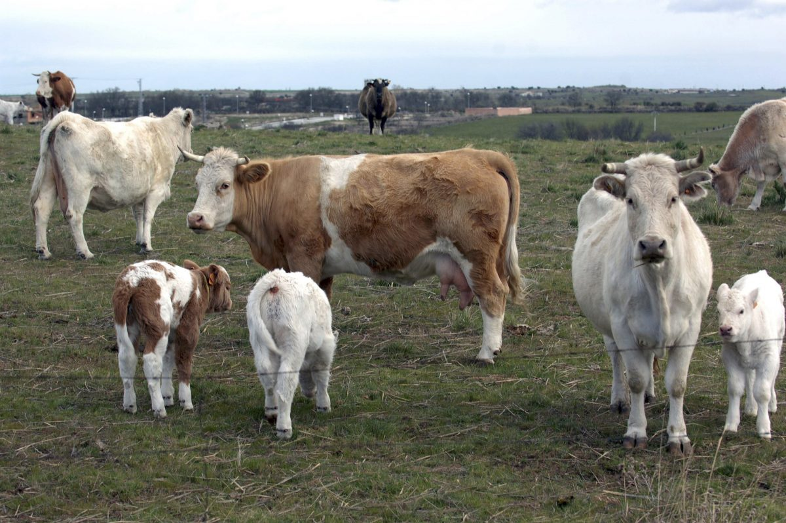
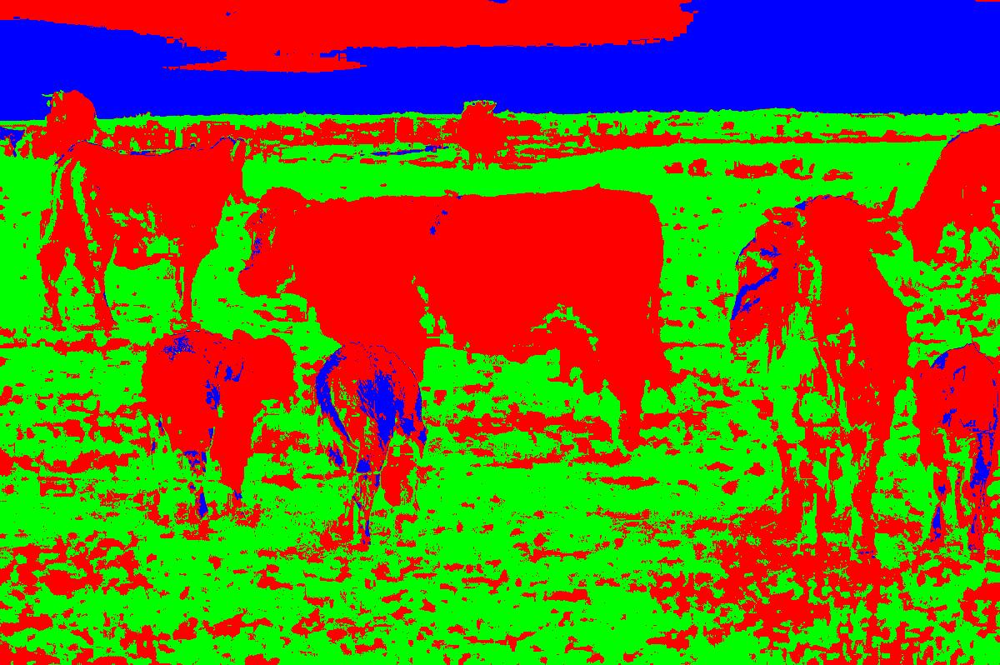
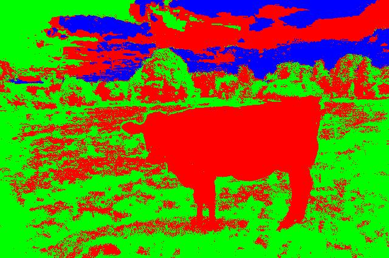
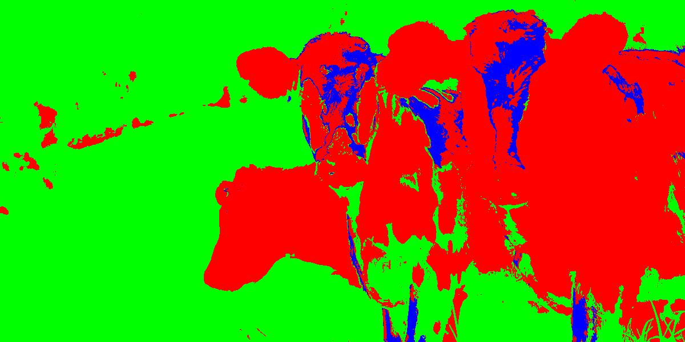

# Ejercicio 1

Utilizar los metodos de SVM y perceptron simple para clasificacion de un dataset preparado por nosotros.

---

## Perceptron simple

Algoritmo de aprendizaje supervisado que se utiliza para clasificar un conjunto de datos en dos categorías, utilizando la función de activación de la función escalón unitario.

---

### Implementacion

Se utilizó la siguiente función escalón:

{.r-stretch}

<!------->

<!--### Entrenamiento-->

 <!-- TODO: Agregar informacion sobre los parametros, la funcion de error, como hace para aprender --->

## SVM

Es un algoritmo de aprendizaje supervisado que se utiliza para clasificar un conjunto de datos en dos categorías, utilizando un hiperplano que maximiza la distancia entre las dos clases.

Siendo capaz de generar planos N dimensionales de la forma:

$$
\vec{w} \cdot \vec{x} + b = 0
$$

---

### Implementacion

Para el entrenamiento, tomamos los datos de entrada e iteramos por cada punto en el plano.
Se calcula la distancia de cada punto al hiperplano y se actualizan los pesos y el bias en caso de que el punto este mal clasificado.

Si esta mal clasificado se corrije con:

$$
\vec{w}^{nuevo} = \vec{w}^{viejo} - k (\vec{w}^{viejo} - Cx_iy_i)\\
b^{nuevo} = b^{viejo} - k (- Cy_i)
$$

Si esta bien clasificado cambia menos:

$$
\vec{w}^{nuevo} = \vec{w}^{viejo} - k \vec{w}^{viejo}
$$

---

Ademas, decrementamos el valor de k en cada iteracion para que el algoritmo converja, con una funcion exponencial decreciente.

$$
k_{nuevo} = k_{viejo} * e^{-currentIteration / maxIterations}
$$

---

Finalmente, para intentar no caer en minimos locales, se implemento el algoritmo de entrenamiento para que sea estocastico.

Tomando una cantidad de puntos aleatorios en cada iteracion, mas concretamente un 50%.

<!-- TODO: POR QUE ELEGIMOS ESTE NUMERO, HACER ALGO -->

---

## Dataset TP3-1

{.r-stretch}

---

### Resultados perceptron simple

:::{.container .r-stretch}
::::{.flex-1}

::::
::::{.flex-1}

::::
:::

---

### Es un hiperplano optimo?

Como podemos ver, si bien los datos se separan correctamente, ya que son linealmente separables, el hiperplano no es optimo, ya que no es el que maximiza la distancia entre las dos clases.

<!-- TODO: Mostrar foro que muestre que no es optimo, marcar la distancia entre las clases y mostrar que no es la maxima. -->

{.r-stretch}

---

### Hiperplano Óptimo

Al aplicar el postprocesado al resultado del perceptron simple, se consigue un mejor margen:

{.r-stretch}

---

### Resultados SVM

{.r-stretch}

---

## Dataset TP3-2

{.r-stretch}

---

### Resultados perceptron simple

:::{.container .r-stretch}
::::{.flex-1}

::::
::::{.flex-1}

::::
:::

---

### Resultados perceptron simple

---

### Resultados SVM

{.r-stretch}

<!------->

<!--### En que se diferencian?-->

<!-- TODO: Esto-->

# Ejercicio 2

Utilizar un modelo SVM para clasificar una imagen.

---

## Datos

Tomando como refencia la imagen principal cow.jpg, se nos provee con las imágenes de muestra
- vaca.jpg
- cielo.jpg
- pasto.jpg

Que son representativas para las clases "vaca", "cielo" y "pasto" respectivamente.

---

## Dataset

Para construír el dataset que se utilizará en el entrenamiento del modelo, se tomará cada una de las imágenes de muestra y por cada píxel se generará un documento en el dataset con los valores RGB del mismo. Además, se clasificará al documento en base a la imagen de la que proviene dicho píxel. 

Es decir, que nuestro dataset estará compuesto por documentos con tres variables (r, g y b) con valores entre 0 y 255 y una clasificación que estará entre "vaca", "past" y "cielo", representada por un valor del conjunto $\{-1,0,1\}$ respectivamente.

$$
D=\{x_i\ /\ x_i=\{(r_i,g_i,b_i),y_i\}\land r_i,g_i,b_i\in [0,\dots,255]\land y_i\{-1,0,1\}\}
$$

---

## Dataset

Para entender mejor el dataset resultante se buscó tomaron ejemplos al azar del mismo y se los ubicó en un espacio tridimensional según los valores de sus atributos. En otras palabras, se buscó realizar una "representación dentro de un cubo RGB" de los datos.

Para entender mejor las características de los datos, se realizó esta representación por separado para cada una de las clases.

---

### Representación por clase

---

### Representación de la imagen original

---

## Dataset

Adicionalmente, para ilustrar mejor la distribución de los datos, se graficaron proyecciones de los cubos.

---

### Representación por clase

---

### Representación de la imagen original

---

## Por que no funciona el SVM?

En este caso, no tenemos una separacion lineal de las clases. No existe hiperplano capaz de separar las clases correctamente.

---

## Que podemos hacer?

Para solucionar este problema, podemos utilizar un kernel que nos permita mapear los datos a un espacio de mayor dimension, donde si exista una separacion lineal.

---

## Kernel

Un kernel es una funcion que nos permite mapear los datos a un espacio de mayor dimension, donde si exista una separacion lineal.

Se aplica a la funcion de decision de la siguiente manera:

$$
f(x) = \sum_{i=1}^{n} \alpha_i K(x_i, x) + b_0
$$

---

### Tipos de kernel

- Lineal
  $$ K(x, x') = x \cdot x' $$
- Polinomial
  $$ K(x_i, x') = (1+\sum^{p}x_{ij} \cdot x_j)^d $$
- Radial
  $$ K(x_i, x') = e^{-\gamma \sum^{p}||x_{ij} - x_j||^2} $$

---

### Modelo

Para poder utilizar kernels no lineales, se empleará la librería scikit learn que ofrece un módulo para la clasificación con modelos SVM. Para la misma se puede elegir entre los tipos de kernel ‘linear’, ‘poly’, ‘rbf’, ‘sigmoid’, donde las primeras tres se corresponden con las funciones ya mencionadas, y el kernel sigmoideo se define por la siguiente función:

$$ K(x_i, x') = \tanh(-\gamma x_{ij} x_j+r) $$

Para la configuración del modelo, además del kernel se pueden modificar otros parámetros de los cuáles el principal es el *parámetro de regularización* $C$, el cuál afecta al cálculo del error dentro del entrenamiento del modelo, donde el mismo se calcula cómo:

$$
C\sum_{i=1,n}\mathcal{L}(f(x_i),y_i)+\Omega (w)
$$

Donde $\mathcal{L}$ es la función de pérdida y $\Omega$ una función de penalización.

Adicionalmente, es posible configurar los parámetros de cada función de kernel que se utilice.

---

## Entrenamiento

---

### Division en training y test

Para la división del dataset entre training y test se realizó un muestreo aleatorio de los datos para cada una de las clases. Para determinar el porcentaje de los datos que se usarán para cada conjunto (tomando como referencia al de entrenamiento) se entrenaron y evaluaron modelos con todos los tipos de kernel y varios valores de $C$, tanto para una división de 70% de datos de entrenamiento, como luego para una división de 80% de datos de entrenamiento. En base a esto se calculó la accuracy de los resultados obtenidos en la evaluación y en base a ésta se determinó que división era más óptima.

---

### Division en training y test

**División 70% training**
|Kernel | C | accuracy|
|-|-|-|
|rbf|1|98.96%|
|rbf | 0.75| 98.96%|
...
|sigmoid | 0.5| 13.01%|
|sigmoid | 1| 12.95%|

---

### Division en training y test

**División 80% training**
|Kernel | C | accuracy|
|-|-|-|
|rbf|1|98.78%|
|rbf | 0.75| 98.77%|
...
|sigmoid | 0.75| 0.118%|
|sigmoid | 1| 0.118%|

---

### Division en training y test

En base a estos resultados obtenidos, se optó por utilizar una división el 70% de datos para el conjunto de training.

---

## Resultados

Se entrenó y evaluó el modelo con los diferentes tipos de funciones de kernel y con los siguientes valores para el parámetro $C$: $\{0.1,0.25,0.5,0.75,1.0\}$

En cada caso se calculó la matriz de confusión y las métricas de precisión, recall y f1-score por clase, junto con un valor de accuracy para el resultado general.

---

### Resultados con kernel lineal

---

### Resultados con kernel polinomial

---

### Resultados con kernel radial

---

### Resultados con kernel sigmoideo

---

## Resultados

En general la variación de los resultados fue mínima al variar el valor de $C$, pero en todos los casos los mejores resultados se obtuviero al utilizar $C=1$.

Esto es verdad también para la variación de los parámetros del kernel. En general, todos los tipos de kernel obtuvieron resultados bastante buenos. 

La excepción a todo esto fue el kernel sigmoideo, que además de dar peores resultados que el resto, la mejor clasificación se obtuvo con $C=1$

---

## Analisis de resultados

Veremos como funicona el SVM con las imagenes dadas.

Para pintar las imágenes se utilizaron colores por clase:
- vaca: Rojo
- cielo: Azul
- pasto: Verde

---

### Imagen cow.jpg

---

### Otras imágenes

---

### Otras imágenes

---

### Otras imágenes

---

### Otras imágenes

---

### Otras imágenes

---

### Otras imágenes

---
<!------->

<!--### NO SE A QUE SE REFIERE EL h)-->

<!------->

# GRACIAS

---